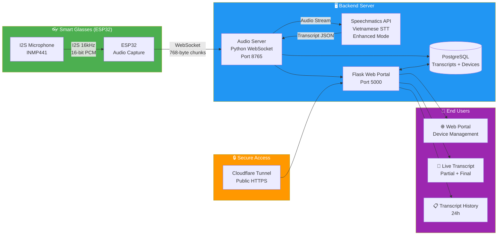

<div align="center">

# 👓 Smart Glasses — Real-time Speech-to-Text
### Mắt Kính Thông Minh Hỗ Trợ Người Khiếm Thính

[](https://www.espressif.com/)
[](https://python.org/)
[](https://flask.palletsprojects.com/)
[](https://websockets.readthedocs.io/)
[](https://www.speechmatics.com/)
[](https://postgresql.org/)

**Hệ thống nhận dạng giọng nói tiếng Việt real-time dành cho người khiếm thính — ESP32 thu âm & stream audio qua WebSocket, server Python xử lý với Speechmatics API, hiển thị transcript trên Web Portal.**

**Real-time Vietnamese speech recognition system for the hearing impaired — ESP32 captures & streams audio via WebSocket, Python server processes with Speechmatics API, displaying transcripts on a Web Portal.**

</div>

---

## 📸 Demo

<!-- 
🔽 THÊM HÌNH ẢNH / VIDEO DEMO TẠI ĐÂY 🔽
Ví dụ:


-->

> ⚠️ *Vui lòng thêm ảnh/video demo mắt kính và web portal tại đây.*
>
> ⚠️ *Please add smart glasses & web portal demo images/videos here.*

---

## 📐 System Architecture / Kiến Trúc Hệ Thống



---

## 🛠️ Tech Stack / Công Nghệ

| Layer | Technology |
|-------|-----------|
| **Embedded** |    |
| **Backend** |   |
| **STT Engine** |  |
| **Real-time** |  |
| **Database** |   |
| **Frontend** |    |
| **Infrastructure** |  |
| **Auth** |  |

---

## ⚡ Key Features & Metrics / Tính Năng & Chỉ Số

| Feature | Metric |
|---------|--------|
| 🎙️ **Audio Pipeline** | Tối ưu hóa pipeline xử lý âm thanh: **16kHz, 16-bit PCM** signed little-endian, chunk size **768 bytes** |
| ⚡ **Độ trễ thấp** / Low Latency | Truyền audio qua WebSocket với `max_delay = 0.7s`, operating point **"enhanced"** |
| 🇻🇳 **Nhận dạng tiếng Việt** / Vietnamese STT | Speechmatics API — hiển thị **partial** (tạm thời) + **final** (hoàn chỉnh) transcript real-time |
| 📱 **Quản lý đa thiết bị** / Multi-device | Đăng ký & quản lý nhiều ESP32, theo dõi trạng thái **online/offline** (IP, MAC, RSSI) |
| 🌐 **Cấu hình WiFi từ xa** / Remote WiFi Config | Cập nhật WiFi credentials cho ESP32 qua web portal — ESP32 tự động apply khi reboot |
| 📋 **Lịch sử transcript** / Transcript History | Lưu trữ toàn bộ vào PostgreSQL, xem **24h gần nhất**, phân biệt partial/final |
| 🔐 **Bảo mật** / Security | **bcrypt** password hashing, device ownership isolation, session management |
| 💓 **Heartbeat tối ưu** / Optimized Heartbeat | Interval **120s**, timeout **60s** — giảm tải server, phát hiện offline nhanh |
| 🌍 **Truy cập từ xa** / Remote Access | **Cloudflare Tunnel** → public HTTPS, không cần port-forwarding |

---

## 🔌 Hardware Setup / Sơ Đồ Đấu Nối

### Pinout Table / Bảng Nối Chân

| Component | Pin / Signal | ESP32 GPIO |
|-----------|-------------|------------|
| **INMP441 (I2S Mic)** | WS (Word Select) | `GPIO 25` |
| | SCK (Clock) | `GPIO 26` |
| | SD (Data) | `GPIO 33` |
| | VDD | `3.3V` |
| | GND | `GND` |
| | L/R | `GND` (Left channel) |

```
  ┌─────────────┐         ┌──────────────────────┐
  │  INMP441     │         │      ESP32            │
  │  I2S Mic     │         │                       │
  │   WS ────────┼────────►│ GPIO 25              │
  │   SCK ───────┼────────►│ GPIO 26              │
  │   SD ────────┼────────►│ GPIO 33              │
  │   VDD ───────┼────────►│ 3.3V                 │
  │   GND ───────┼────────►│ GND                  │
  │   L/R ───────┼────────►│ GND                  │
  └─────────────┘         │                       │
                           │  WiFi ──► WebSocket   │
                           │          (ws://IP:8765)│
                           └──────────────────────┘
```

> 💡 **Note:** ESP32 thu âm liên tục với I2S ở **16kHz sample rate**, gửi qua WebSocket dưới dạng PCM 16-bit chunks.

---

## 🚀 How to Run / Hướng Dẫn Chạy

### 1. Prerequisites / Yêu cầu
```
• Python 3.8+
• PostgreSQL 12+
• Cloudflared CLI (optional, cho remote access)
• ESP32 + INMP441 I2S Microphone
• Speechmatics API Key (https://www.speechmatics.com/)
```

### 2. Installation / Cài đặt

```bash
# Clone repository
git clone https://github.com/duc2512/Smart-Glasses-Real-time-Speech-to-Text-Devices-for-the-Hearing-Impaired.git
cd Smart-Glasses-Real-time-Speech-to-Text-Devices-for-the-Hearing-Impaired

# Tạo virtual environment
python -m venv .venv
.venv\Scripts\activate          # Windows
# source .venv/bin/activate     # Linux/Mac

# Cài đặt dependencies
pip install -r web_portal/requirements.txt
pip install speechmatics websockets httpx
```

### 3. Database Setup

```sql
-- Tạo database PostgreSQL
psql -U postgres
CREATE DATABASE esp32_management;
\c esp32_management
\i database/schema.sql
```

### 4. Configuration / Cấu hình

Tạo file `.env` trong thư mục `web_portal/`:
```env
DB_HOST=localhost
DB_NAME=esp32_management
DB_USER=postgres
DB_PASSWORD=your_password
DB_PORT=5432
SECRET_KEY=your_secret_key
```

Cập nhật Speechmatics API Key:
```python
# Trong file final_lap/esp32_realtime_server.py:
API_KEY = "your_speechmatics_api_key"
```

### 5. Khởi chạy / Start

```bash
# Khởi động tất cả dịch vụ / Start all services
start_all.bat

# Tự động khởi động:
# 1. ESP32 Audio Server (port 8765)
# 2. Cloudflare Tunnel (public access)
# 3. Web Portal (port 5000)
```

### 6. Truy cập / Access

| Method | URL |
|--------|-----|
| **Local** | `http://localhost:5000` |
| **LAN** | `http://<your-ip>:5000` |
| **Public** | `https://esp32.ptitavitech.online` (Cloudflare Tunnel) |

---

## 📁 Project Structure / Cấu Trúc Dự Án

```
Smart-Glasses-.../
├── database/                          # 🗄️ Database
│   ├── schema.sql                     # PostgreSQL schema
│   ├── add_speaker_column.sql         # Migration: speaker column
│   └── MIGRATION_GUIDE.md            # Migration guide
│
├── final_lap/                         # 🚀 Production Server
│   ├── esp32_realtime_server.py       # Main audio WebSocket server
│   ├── config.yml                     # Cloudflare Tunnel config
│   └── ESP32_Realtime_Streaming/      # ESP32 firmware (C++)
│
├── server_lap/                        # 🧪 Development Server
│   └── lap_realtime_server.py         # Test server
│
├── web_portal/                        # 🌐 Flask Web Application
│   ├── app.py                         # Main Flask app
│   ├── requirements.txt              # Python dependencies
│   └── templates/                     # HTML templates (Bootstrap)
│
└── start_all.bat                      # ▶️ One-click startup
```

---

## 🔗 API Endpoints

| Method | Endpoint | Description |
|--------|----------|-------------|
| `POST` | `/api/devices` | Đăng ký thiết bị mới / Register device |
| `GET` | `/api/devices` | Danh sách thiết bị / List devices |
| `PUT` | `/api/devices/<id>/wifi` | Cập nhật WiFi config / Update WiFi |
| `GET` | `/api/transcripts/<device_id>` | Lịch sử transcript / Transcript history |
| `WS` | `ws://server:8765` | Audio streaming (ESP32 → Server) |

---

## 👤 Author

**Le Tho Duc** — [GitHub @duc2512](https://github.com/duc2512)

---

<div align="center">
⭐ If you find this project useful, please give it a star! ⭐
</div>
